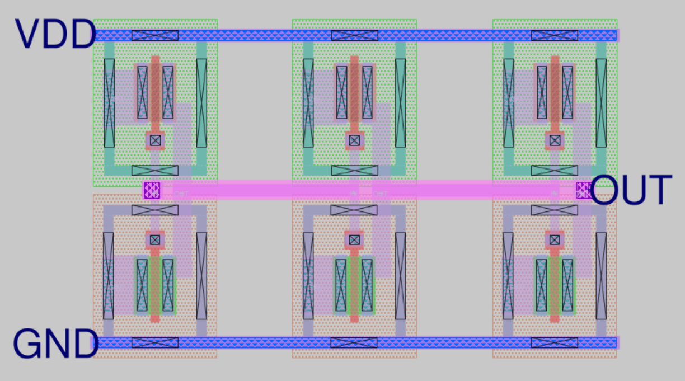

# Ring Oscillator - Analog IC Design

Ring oscillator terdiri dari tiga inverter yang dihubungkan dalam loop tertutup untuk menghasilkan osilasi. Rangkaian ini umum digunakan dalam pengujian kecepatan proses dan aplikasi frekuensi tinggi.

## Preview Layout

## Konfigurasi
- Terdiri dari 3 inverter
- VDD: 1.8V, GND: 0V
- Output menunjukkan sinyal osilasi hasil delay

## Hasil LVS
Skematik dan layout **match**

## Tools
- Xschem
- Magic VLSI
- Ngspice

